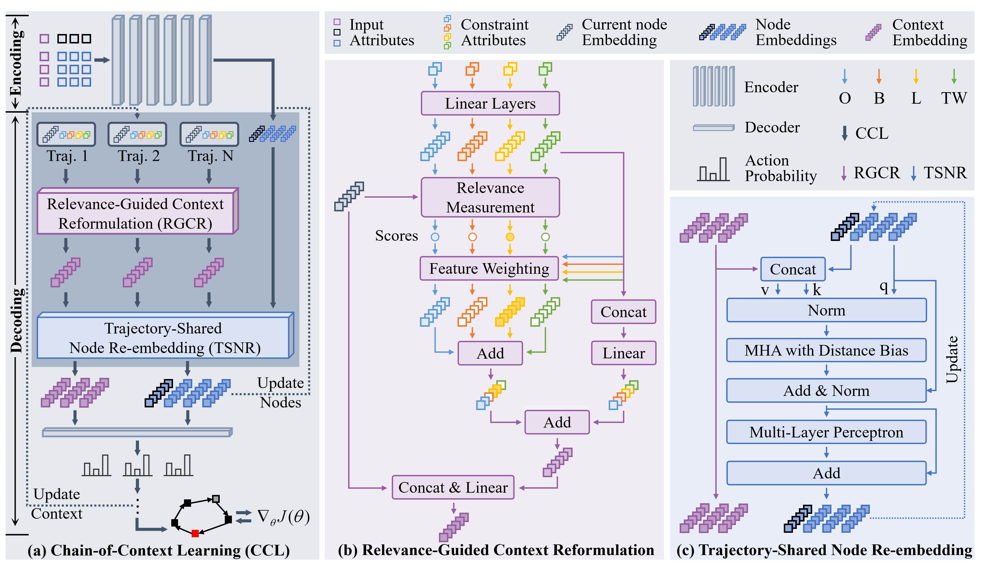

# **Chain-of-Context Learning:** Dynamic Constraint Understanding for Multi-Task VRPs

<i>Shuangchun Gui, Suyu Liu, Xuehe Wang, Zhiguang Cao</i>

---

<div align="center">
    
</div>


## 🔧 Installation


```bash
conda env create -f environment.yml
conda activate CCL
pip install -e .
```

## 📦 Download Data and Pretrained Models

Please download the required datasets and pretrained models from the following link:

**Download link:**  
https://drive.google.com/file/d/1eI48maML3n4HDwYIMwbOgA_4e9WODHBw/view?usp=sharing

After downloading, place the files in the following directories:
```bash
./CCL/data
./CCL/logs
./CCL-ReLD/logs
```


## 🧪 Evaluation

```bash
cd CCL-ReLD
# N=50
python test.py --size 50 --checkpoint './logs/0424-routefinder-LO-CaDA-ReLD-dotNoise-P75-50-main/2025-04-24_21-08-31/checkpoints/epoch_295.ckpt'
# N=100
python test.py --size 100 --checkpoint './logs/0424-routefinder-LO-CaDA-ReLD-dotNoise-P20-newO-100-main/2025-04-27_11-39-29/checkpoints/epoch_299.ckpt'
```

## 🚀 Training

```bash
cd CCL-ReLD
python run.py experiment=main/rf/rf-transformer-50
```

## 🙏 Acknowledgements


The implementation of CCL is built upon the codebases of:

- [RouteFinder](https://github.com/ai4co/routefinder)  
- [ReLD](https://github.com/ziweileonhuang/reld-nco)

We sincerely thank the authors for making their code publicly available.

## 📚 Citation

If this code is useful for your research, please consider citing:

  ```shell
@inproceedings{
gui2026chainofcontext,
title={Chain-of-Context Learning: Dynamic Constraint Understanding for Multi-Task {VRP}s},
author={Shuangchun Gui and Zhiguang Cao and Suyu Liu and Xuehe Wang},
booktitle={The Fourteenth International Conference on Learning Representations},
year={2026},
url={https://openreview.net/forum?id=AhE6aSlz5g}
}

  ```

## 📩 Contact
* Shuangchun Gui (gshuangchun@outlook.com)


